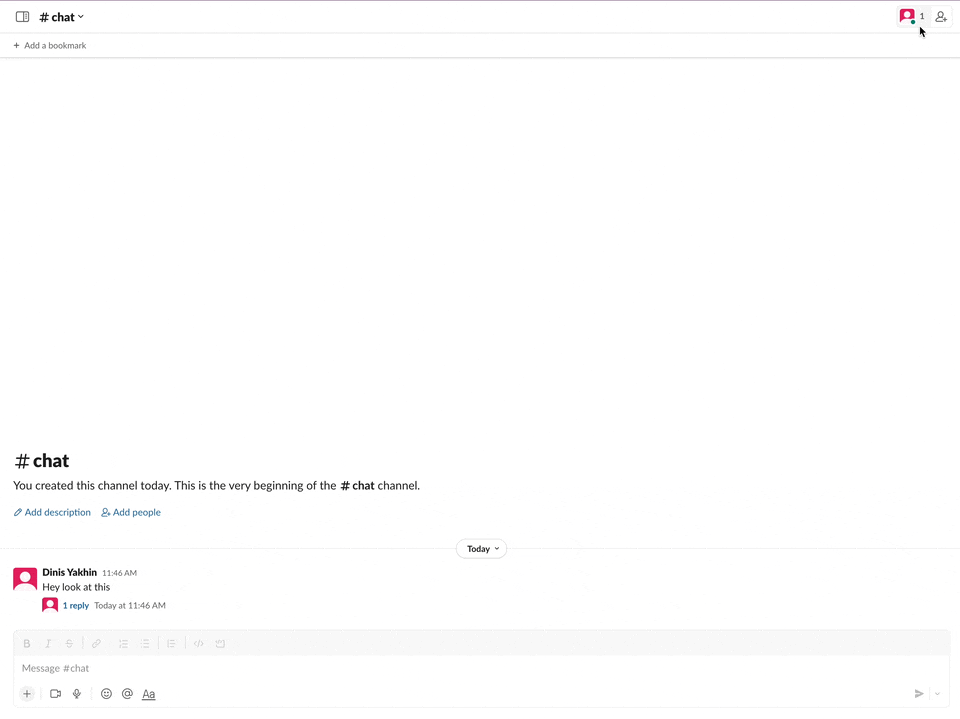
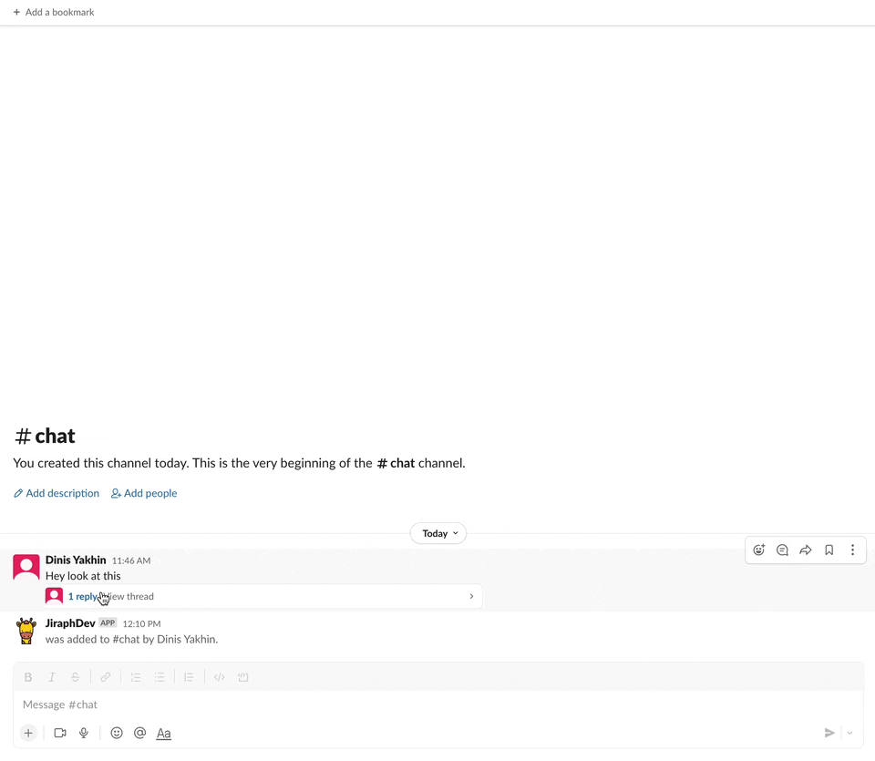
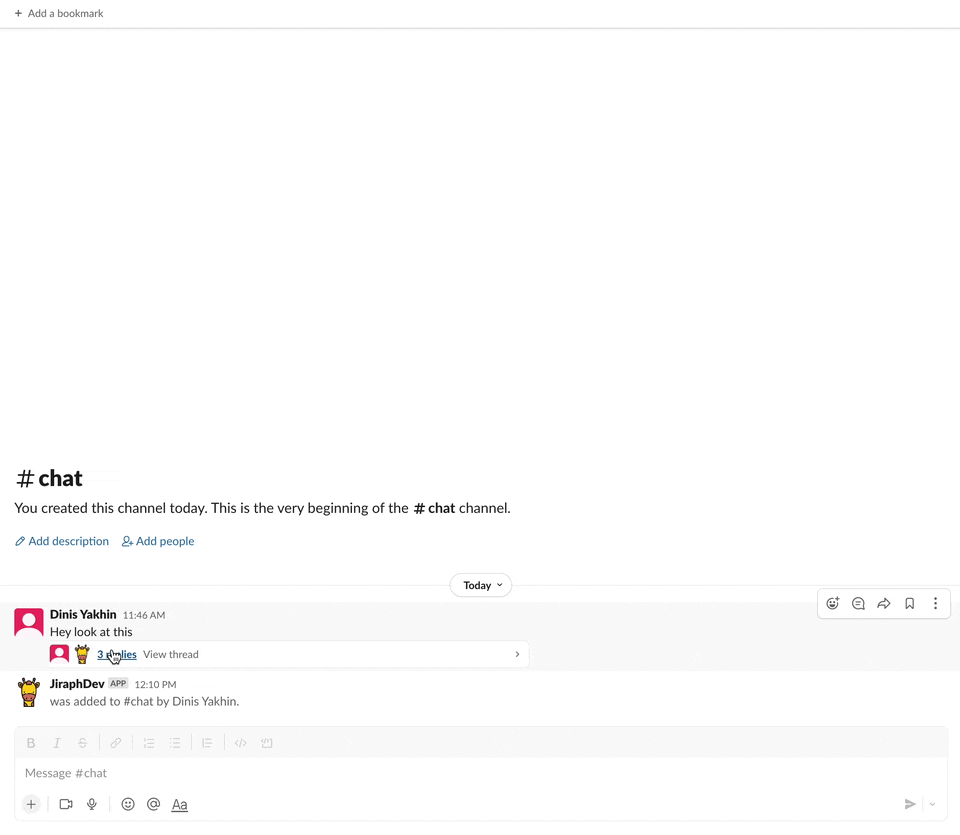

# Jiraph Slack App
### Features

 - Create Jira Issue from Slack thread and upload whole thread to comment section
 - Upload/Update thread in existing Jira Issue

---
## How to use

<details><summary>How to add app to chat (click to open)</summary></details>
<details><summary>How to create issue from thread (click to open)</summary></details>
<details><summary>How to upload/update thread to existing issue (click to open)</summary></details>


--- 
## Setting up Slack App

1. Go to https://api.slack.com/apps
2. Press create new app button
3. Choose "From an app manifest [BETA]"
4. Select your workspace
5. Choose YAML
6. Copy content from [`manifest.yml`](./manifest.yml) into dialog window and press next button
7. Press Create button
8. On the **Basic Information** page scroll down to **App-Level Tokens** section and press **Generate Token and Scopes** 
9. Set name to your token and add `connections:write` scope, then click **Generate**. You'll get `xapp` token, save it. 
8. Go to the **OAuth & Permissions** and instal app, then get **Bot User OAuth Token** starting with `xoxb`

### Credentials
Set up your credentials in `.env-example` file, then rename it from `.env-example` to `.env`
```
SLACK_BOT_TOKEN - xoxb token from step 8
SLACK_APP_TOKEN - xapp token from step 9
JIRA_USER - jira login for app user
JIRA_PASS - jira pass for app user
JIRA_URL - jira host list http://jira.test.com/
APP_NAME - You can choose your name for the app or leave it empty
```
---
## Run application

### Launch from terminal

Requires Python 3.10 or higher

Set up your virtual environment then
```
pip install -r requirements.txt
python -m jiraph_bot
```

### Launch from docker

```
docker build -t jiraph .
docker run -d jiraph
```